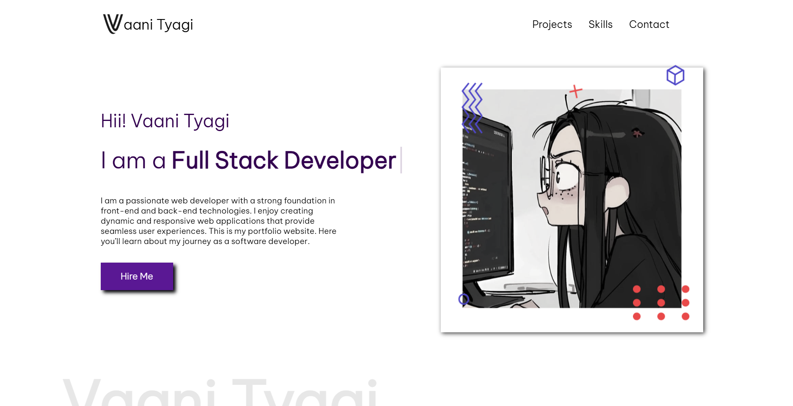

# 🌐 Personal Portfolio Website

A simple and responsive personal portfolio website built using **HTML and CSS**. This project showcases my skills, projects, education, and personal information in a clean and professional design.

## ✨ Features

* 🏠 **Home Section** — Introduction and welcome message
* 👨‍💻 **About Me** — Personal introduction and background
* 🛠️ **Skills Section** — Overview of my technical skills
* 💼 **Projects Section** — Display of my projects and work
* 📱 **Responsive Design** — Designed to work on different screen sizes
* 🎨 **Clean UI** — Simple and modern layout using CSS

## 🛠️ Technologies Used

* **HTML5** — For creating the structure and content
* **CSS3** — For styling, layout, animations, and responsiveness

## 📂 Project Structure

```text
portfolio/
│
├── index.html
├── style.css
├── images/
│   └── ...
└── README.md
```

## 🚀 How to Run

1. Clone this repository:

```bash
git clone https://github.com/your-username/portfolio.git
```

2. Open the project folder.

3. Open `index.html` in your web browser.

That's it! No additional installation or dependencies are required.

## 🎯 Project Purpose

The purpose of this project is to create a personal portfolio website that presents my skills, projects, and background while demonstrating my understanding of **HTML and CSS**.

## 📸 Screenshots



## 👤 Author

Vaani Tyagi

⭐ If you like this project, feel free to give it a star!
